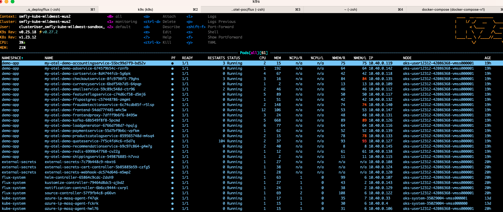
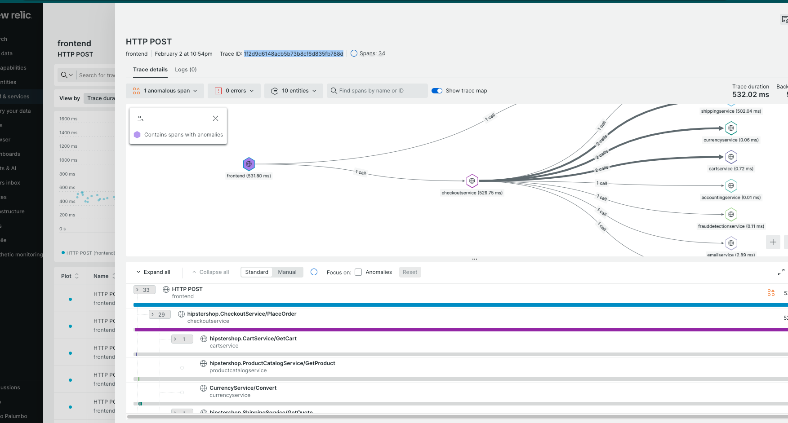

# Flux Documentation

Example

```
apiVersion: v1
kind: Namespace
metadata:
  name: monitoring-flux
  annotations:
    kustomize.toolkit.fluxcd.io/prune: disabled
---
apiVersion: source.toolkit.fluxcd.io/v1beta1
kind: HelmRepository
metadata:
  name: grafana
  namespace: monitoring-flux
spec:
  interval: 15m0s
  url: https://grafana.github.io/helm-charts
---
apiVersion: source.toolkit.fluxcd.io/v1beta1
kind: HelmRepository
metadata:
  name: opentelemetry
  namespace: monitoring-flux
spec:
  interval: 15m0s
  url: https://open-telemetry.github.io/opentelemetry-helm-charts
---
apiVersion: helm.toolkit.fluxcd.io/v2beta1
kind: HelmRelease
metadata:
  name: tempo
spec:
  chart:
    spec:
      chart: tempo
      sourceRef:
        kind: HelmRepository
        name: grafana
        namespace: monitoring-flux
  install: {}
  interval: 60m0s

  values: 
    tempo:
      extraArgs:
        "distributor.log-received-traces": true
      receivers:
        jaeger:
          protocols:
            grpc:
              endpoint: 0.0.0.0:14250
            thrift_binary:
              endpoint: 0.0.0.0:6832
            thrift_compact:
              endpoint: 0.0.0.0:6831
            thrift_http:
              endpoint: 0.0.0.0:14268
        opencensus:
        otlp:
          protocols:
            grpc:
              endpoint: "0.0.0.0:4317"
            http:
              endpoint: "0.0.0.0:4318"
---
apiVersion: helm.toolkit.fluxcd.io/v2beta1
kind: HelmRelease
metadata:
  name: loki-stack
spec:
  chart:
    spec:
      chart: loki-stack
      sourceRef:
        kind: HelmRepository
        name: grafana
        namespace: monitoring-flux
  install: {}
  interval: 60m0s

  values:
    fluent-bit:
      enabled: false
    promtail:
      enabled: true
      config:
        clients:
          - url: http://loki-stack.monitoring-flux.svc.cluster.local:3100/loki/api/v1/push 
    prometheus:
      enabled: true
      alertmanager:
        persistentVolume:
          enabled: false
      server:
        persistentVolume:
          enabled: false
---
apiVersion: helm.toolkit.fluxcd.io/v2beta1
kind: HelmRelease
metadata:
  name: grafana
spec:
  chart:
    spec:
      chart: grafana
      sourceRef:
        kind: HelmRepository
        name: grafana
        namespace: monitoring-flux
  install: {}
  interval: 60m0s

  values:
    rbac:
      namespaced: true
      pspEnabled: false
      pspUseAppArmor: false
    datasources:
      datasources.yaml:
        apiVersion: 1
        datasources:
          - name: Tempo
            type: tempo
            access: browser
            orgId: 1
            uid: tempo
            url: http://tempo.monitoring-flux.svc.cluster.local:16686
            isDefault: true
            editable: true
          - name: Loki
            type: loki
            access: browser
            orgId: 1
            uid: loki
            url: http://loki-stack.monitoring-flux.svc.cluster.local:3100
            isDefault: false
            editable: true
            jsonData:
              derivedFields:
                - datasourceUid: tempo
                  matcherRegex: \[.+,(.+),.+\]
                  name: TraceID
                  url: $${__value.raw}
          - name: Prometheus
            type: prometheus
            access: proxy
            orgId: 1
            url: http://loki-stack.monitoring-flux.svc.cluster.local:9090
            basicAuth: false
            isDefault: false
            version: 1
            editable: false
  
    env:
      JAEGER_AGENT_PORT: 6831

    adminUser: admin
    adminPassword: password

    service:
      enabled: true
      type: ClusterIP
---
apiVersion: helm.toolkit.fluxcd.io/v2beta1
kind: HelmRelease
metadata:
  name: otel-collector
spec:
  chart:
    spec:
      chart: opentelemetry-collector
      sourceRef:
        kind: HelmRepository
        name: opentelemetry
        namespace: monitoring-flux
      version: 0.40.2
  install: {}
  interval: 60m0s

  values:
    mode: deployment
    replicaCount: 1
    presets:
      clusterMetrics:
        enabled: true
      kubernetesAttributes:
        enabled: true
    config:
      exporters:
        otlp:
          endpoint: http://tempo.monitoring-flux.svc.cluster.local:4317
          tls:
            insecure: true
        otlphttp:
          endpoint: https://otlp.nr-data.net:4318
          headers:
            api-key: 
        logging:
          logLevel: DEBUG
      processors:
        batch:
          send_batch_size: 10000
          send_batch_max_size: 11000
          timeout: 10s
        resource:
            attributes:
              - key: host.id
                from_attribute: host.name
                action: upsert
        resourcedetection:
          detectors: [ azure ]
          timeout: 2s
        k8sattributes:
          auth_type: "serviceAccount"
          passthrough: false
          filter:
            node_from_env_var: KUBE_NODE_NAME
          extract:
            metadata:
              - k8s.pod.name
              - k8s.pod.uid
              - k8s.deployment.name
              - k8s.namespace.name
              - k8s.node.name
              - k8s.pod.start_time
          pod_association:
            - sources:
              - from: resource_attribute
                name: k8s.pod.uid
      service:
        pipelines:
          metrics:
            exporters: [ logging, otlphttp ]
            processors: [ resourcedetection, k8sattributes, resource, batch ]
          traces:
            exporters: [ logging, otlp, otlphttp ]
            processors: [ resourcedetection, k8sattributes, resource, batch ]


```
# Port Forwarding for testing

```

kubectl port-forward svc/otel-collector-opentelemetry-collector 14268:14268 -n monitoring-flux & \
kubectl port-forward svc/otel-collector-opentelemetry-collector 14250:14250 -n monitoring-flux & \
kubectl port-forward svc/tempo 3100:3100 -n monitoring-flux & \
kubectl port-forward svc/tempo 16686:16686 -n monitoring-flux & \
kubectl port-forward svc/loki-stack 3101:3100 -n monitoring-flux & \
kubectl port-forward svc/loki-stack-prometheus-server 9090:80 -n monitoring-flux & \
kubectl port-forward $(kubectl get pods -n monitoring-flux -o name | grep grafana) 3000:3000 -n monitoring-flux &
```

      - "14268:14268"   # jaeger ingest, Jaeger - Thrift HTTP
      - "14250:14250"   # Jaeger - GRPC
      - "55680:55680"   # OpenTelemetry
      - "3102:3100"     # tempo
      - "16686:16686"   # jaeger-ui
      - "3101:3100"     # loki needs to be exposed so it receives logs
      - "9090:9090"     # prometheud
      - "3000:3000"     # grafana


# Deploying sample app

```
flux get all -A

W0203 12:06:16.101131   75523 azure.go:92] WARNING: the azure auth plugin is deprecated in v1.22+, unavailable in v1.26+; use https://github.com/Azure/kubelogin instead.
To learn more, consult https://kubernetes.io/docs/reference/access-authn-authz/authentication/#client-go-credential-plugins
NAMESPACE       	NAME                        	REVISION	SUSPENDED	READY	MESSAGE
external-secrets	helmrelease/external-secrets	0.7.0   	False    	True 	Release reconciliation succeeded
monitoring-flux 	helmrelease/grafana         	6.50.7  	False    	True 	Release reconciliation succeeded
monitoring-flux 	helmrelease/loki-stack      	2.8.9   	False    	True 	Release reconciliation succeeded
monitoring-flux 	helmrelease/otel-collector  	0.40.2  	False    	True 	Release reconciliation succeeded
monitoring-flux 	helmrelease/tempo           	1.0.0   	False    	True 	Release reconciliation succeeded
```

```
helm install my-otel-demo open-telemetry/opentelemetry-demo -n demo-app --values sample-app-values.yaml
```

Ref> https://github.com/open-telemetry/opentelemetry-helm-charts/tree/main/charts/opentelemetry-demo



```
kubectl port-forward svc/my-otel-demo-frontendproxy 8080:8080 -n demo-app
```

```
kubectl port-forward $(kubectl get pods -n monitoring-flux -o name | grep grafana) 33000:3000 -n monitoring-flux
```

# Newrelic

